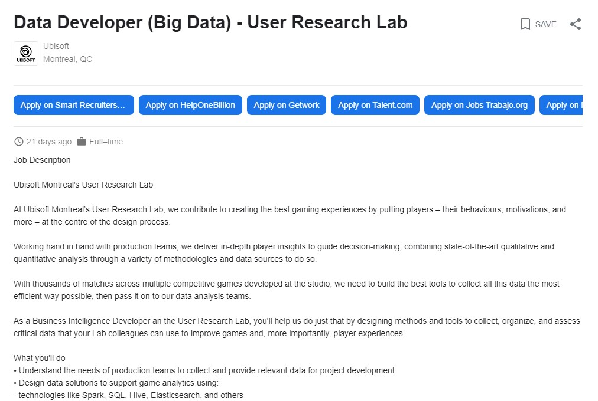

# Task 1: Data Science Careers

Insert the job descriptions here (links, info, etc) and the images.
For example, 

1. [Data Scientist Intern – May at IBM](https://www.google.com/search?q=data+sciences&rlz=1C1CHBF_enCA839CA839&oq=data+sciences+job&aqs=chrome..69i57j0i10i131i433i457j0i402l2j0i10l6.6362j0j7&sourceid=chrome&ie=UTF-8&ibp=htl;jobs&sa=X&ved=2ahUKEwjw-tv1_MP0AhXbj4kEHWE6BuMQutcGKAF6BAgYEAc&sxsrf=AOaemvK5MQ7sJIVVMkX_H4z86rYMjY8NOA:1638408937480#fpstate=tldetail&htivrt=jobs&htidocid=ZeF83UkDgSBP8iMCAAAAAA%3D%3D)\
Successful IBM Client Engineering Hires
    - Demonstrate a growth mindset and continuous learning; stay current on IBM strategies and products with hands on technical growth in data science and cloud native computing
    - Use MLOps practices and methods to plan and create AI applications to address business challenges
    - Be conversant and knowledgeable about technology trends and how technology is being applied to address business challenges
    - Demonstrate strong analytical, problem solving, and troubleshooting skills combined with an agile process
    - Motivated to lead successful projects and meet technical and business objectives
    - Strong professional verbal, written, and interpersonal skills

2. [Senior Data Scientist - Digital Marketing and Insights at National Bank](https://www.google.com/search?q=data+sciences+job&rlz=1C1CHBF_enCA839CA839&oq=data+sciences+job&aqs=chrome..69i57j0i10i131i433i457j0i402l2j0i10l6.6362j0j7&sourceid=chrome&ie=UTF-8&ibp=htl;jobs&sa=X&ved=2ahUKEwjw-tv1_MP0AhXbj4kEHWE6BuMQutcGKAF6BAgYEAc&sxsrf=AOaemvK5MQ7sJIVVMkX_H4z86rYMjY8NOA:1638408937480#htivrt=jobs&htidocid=xgtBrjuVK-h4_I_0AAAAAA%3D%3D&fpstate=tldetail)\
As a Data Scientist, Digital Marketing Analytics and Insights at National Bank, you'll be at the centre of strategic discussions that focus on implementing data-driven recommendations. You’ll be in charge of marketing data valorization using artificial intelligence algorithms. You’ll support audience management and the optimization of the Bank’s digital campaigns and platforms.\
What we expect of you:
    - Define data science best practices within digital marketing
    - Draw up a strategic roadmap (data, ideas, analysis)
    - Lead the development of the continuous optimization of advanced analytics
    - Work with the department responsible for business intelligence
    - Oversee trends and breakthroughs in the fields of web analytics and data science

3. [Data Developer (Big Data) - User Research Lab at Ubisoft](https://www.google.com/search?q=data+sciences+job&rlz=1C1CHBF_enCA839CA839&oq=data+sciences+job&aqs=chrome..69i57j0i10i131i433i457j0i402l2j0i10l6.6362j0j7&sourceid=chrome&ie=UTF-8&ibp=htl;jobs&sa=X&ved=2ahUKEwjw-tv1_MP0AhXbj4kEHWE6BuMQutcGKAF6BAgYEAc&sxsrf=AOaemvK5MQ7sJIVVMkX_H4z86rYMjY8NOA:1638408937480#htivrt=jobs&htidocid=B3mn-gbigRiUgCMNAAAAAA%3D%3D&fpstate=tldetail)\
What you'll do
    - Understand the needs of production teams to collect and provide relevant data for project development.
    - Design data solutions to support game analytics using:
    - technologies like Spark, SQL, Hive, Elasticsearch, and others
    - a DevOps development methodology and relevant tools such as Git
    - Expand your knowledge by exploring, testing, and deploying new technologies.
    - Find solutions adapted to the needs of the analysis teams by creating new data collection processes while optimizing existing ones.
    - Oversee the integrity of the data collected by building appropriate tools.
    - Provide all the essential information our data analyst teams need by working closely with them + monitor project development to anticipate what data will be important to collect.
    - Communicate with various cross-functional teams (like online solutions and data visualization) to discuss and share information and knowledge.

I'm interested in applying what I learned to an exciting field such as the gaming industry and digital marketing. For 1, I'm interested in directly with customers and applying data science and machine learning to build solutions to business problems. For 2, web analytics and digital marketing seem to be interesting fields to apply data science. 3 has a particular focus in collection user data to improve player experience in games. This job emphazes on data collection, I would be equally interested in a position in the data analysis team. Overall, I find that most of the data science postings focus on building machine learning models rather than the data science process. I think my interest lies somewhere in the middle of a data scientist and an analyst.

# Task 2: Highs and Lows

I really liked the assignments and final project in this course. I find them to be interesting, practical and connected to the real world. The lecture format is also a plus for me as it is short, well structured and easy to digest. 

Even though I'm not really interested in machine learning, this course presented a new perspective on data science and inspired my interest. I discovered something new that is interesting and widely applicable. I'm planning to pursue graduate studies in data science or related areas to get a better view of the field and hope to get into an industry that I like.